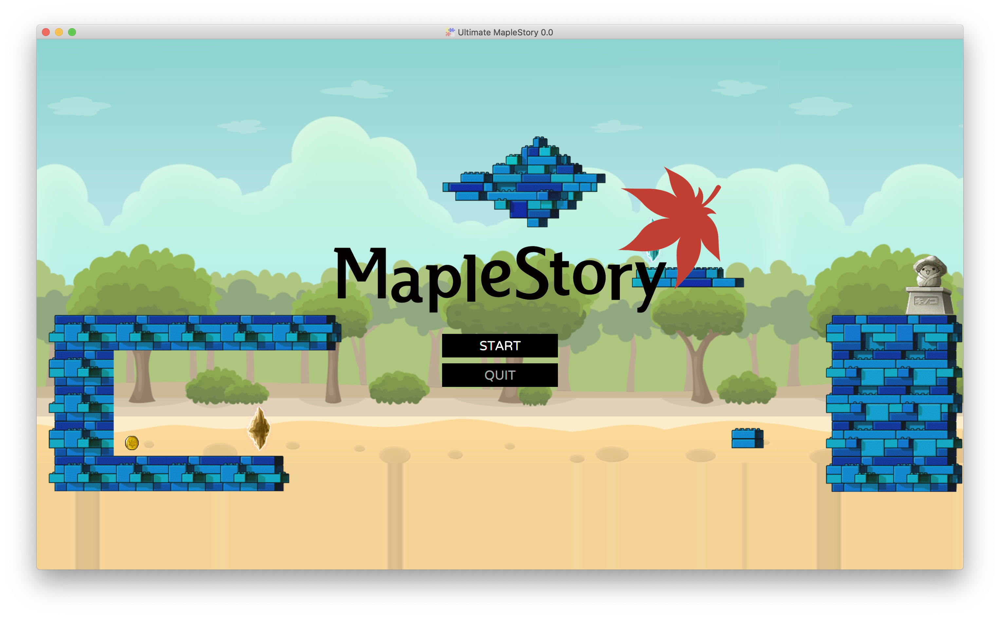
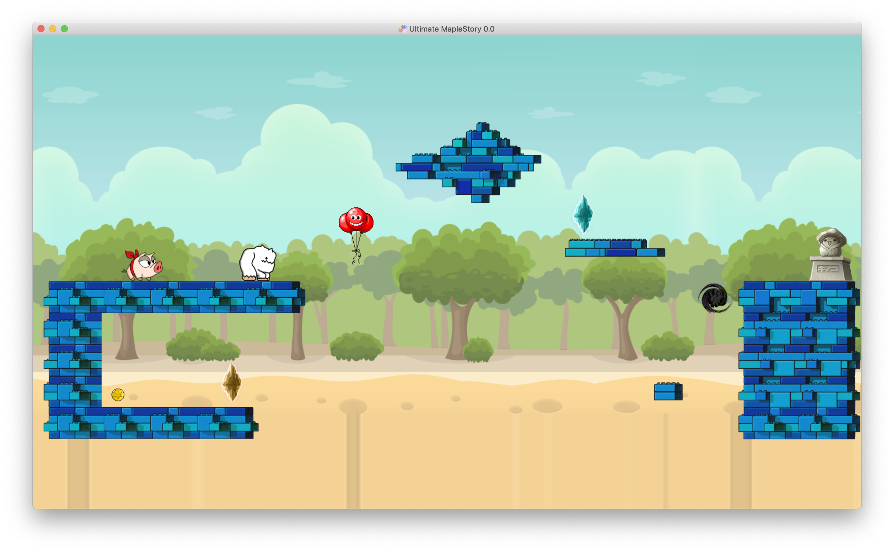
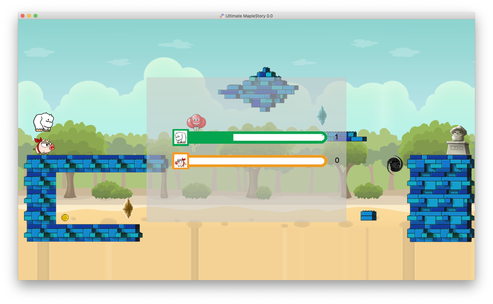

# Ultimate Maplestory 

## Introduction
This is a simple party game featuring the characters of MapleStory which can have 2 players to compete to get to the destination.

This game is derived from [Ultimate Chicken Horse](https://en.wikipedia.org/wiki/Ultimate_Chicken_Horse)

## Requirements
- JDK 14.0
- Maven
- FXGL

## Features
The resources of the characters is from [The Sprites Resources](https://www.spriters-resource.com/pc_computer/maplestory/)

### Characters
1. Yeti
2. Mushroom
3. Pig
4. Slime

### Items
There are 5 items which can be chosen:
1. balloon: an extra platform type item
2. prianha: an enemy item which will harm both players
3. black hole: an dangerous item which will kill players
4. brick: an extran platform type item
5. bomb: an item that can remove the item which is already placed on the map

### Map
There are some items be originally placed on the map:
1. Transport point: when the players touch the blue transport point, then the character will be transport to the orange transport point.
2. Coin: to punish the greedy player, who try to get the coin will die immediately.
3. Mushroom statue: the destination for players to reach

## How to play
### Choose the characters
There are 4 characters for players to choose in this game:

### Start to play
After choosing the characters, there are 3 stages for players to competition in the game
1. Select items
the select screen will automatically be opened when all players ending up choosing their own characters
then there are 5 items for the players to choose and set up to the map

After placing the items, the game will enter next stage.

2. Competing to the destination
Both players must move their characters to reach the destination which is set to the right of the map

3. Show up the score
When both players are either arriving to the destination or die, the score panel will be show up, players can view of their current score.
If either a player first get 3 score, then the game will be overed.

## Game Screen

## TODO
- Null value exception may occur when we trying to use bombs to remove items
- Add networking features to support playing across Internet
